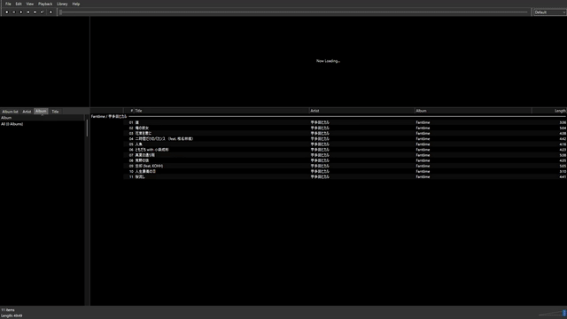

# Album Train

A Columns UI panel component for foobar2000 (64-bit only). Inspired by the "Discovery Train" feature from Sony's "x-アプリ" ("x-appli"), it displays album artwork from your library scrolling across the panel in a horizontal row.

foobar2000（64bit版）向けの Columns UI パネルコンポーネントです。Sony「x-アプリ」の「ディスカバリートレイン」を参考に、ライブラリ内のアルバムアートワークを横一列に流れるように表示します。

## Screenshot / スクリーンショット

**Startup and scrolling / 起動〜スクロール動作**



**Click artwork to play / アートワーククリックで再生**


## Requirements / 動作環境

- foobar2000 v2.x (**64-bit only**. 32-bit is not supported)
- Columns UI 3.5.0 or later

- foobar2000 v2.x（**64bit版のみ**。32bit版には対応していません）
- Columns UI 3.5.0以降

## Installation / インストール方法

1. Download the latest `album_train.fb2k-component` from [Releases](../../releases)
2. Open `File → Preferences → Components` in foobar2000
3. Click `Install...` and select the downloaded `.fb2k-component` file
4. Click `OK` and restart foobar2000

After installation, add the "Album Train" panel to your layout from Columns UI's layout editing mode. Alternatively, you can add it via `Preferences → Display → Columns UI → Layout → Add child → Panels`.

1. [Releases](../../releases) から最新の `album_train.fb2k-component` をダウンロード
2. foobar2000 の `File → Preferences → Components` を開く
3. `Install...` をクリックし、ダウンロードした `.fb2k-component` ファイルを選択
4. `OK` を押し、foobar2000 を再起動

インストール後、Columns UI のレイアウト編集モードから「Album Train」パネルをレイアウトに追加してください。あるいは、`Preferences → Display → Columns UI → Layout → Add child → Panels` の操作からパネルを追加することもできます。

## Usage / 使い方

### Basic operation / 基本操作

- **Left click**: Adds all tracks from the clicked album to a new playlist and plays it
- **Right click**:
  - On empty space (no artwork) → shows `Settings...` only
  - On artwork → shows `Settings...` plus `Properties`. Clicking `Properties` opens the Properties window with all tracks of that album selected
- **Mouse wheel**: Manual scrolling (can be turned on/off in settings)

- **左クリック**：クリックしたアルバムの全曲を新規プレイリストに追加し、再生します
- **右クリック**：
  - アートワーク以外の場所 → `Settings...`（設定ダイアログ）のみ表示
  - アートワーク上 → `Settings...` に加えて `Properties` を表示。クリックすると、そのアルバム全曲が選択された状態で Properties ウィンドウが開きます
- **マウスホイール**：手動でのスクロール（設定でオン/オフ可能）

### Settings dialog / 設定ダイアログ

Right-click → `Settings...` lets you customize appearance and behavior, organized into the following groups.

right-click → `Settings...`から、以下のグループで外観・挙動をカスタマイズできます。

| Group / グループ | Description / 内容 |
|---|---|
| **Mode** | Switch between Stability Focused (lightweight) and Customization Focused / Stability Focused（軽量・安定性重視）／ Customization Focused（カスタマイズ性重視）の切り替え |
| **Theme** | Whether to follow Columns UI's theme colors / Columns UI のテーマ色に追従するかどうか |
| **Artwork** | Display quality (High/Middle/Low), perspective effect, whether to show albums without artwork, and its color or custom image / 表示品質（High/Middle/Low）、遠近感演出、アートワーク未登録アルバムの表示有無、その色または任意画像 |
| **Scroll** | Scroll direction, scroll speed, whether mouse wheel scrolling is allowed / 流れる方向、スクロール速度、マウスホイール操作の許可 |
| **Text** | Whether to show album name, font, color, display format (Title Formatting support), second line, fixed text position / アルバム名表示の有無、フォント、色、表示フォーマット（Title Formatting対応）、2行目表示、テキスト位置の固定 |
| **Background** | Background color or custom image, and its display quality / 背景色または任意画像、その表示品質 |

Selecting Stability Focused mode automatically forces "show albums without artwork" on and locks display quality to Low (a safety measure to reduce load).

Stability Focused モードを選択すると、アートワーク未登録アルバムを常に表示する設定と、表示品質が自動的に Low に固定されます（負荷を軽減するための安全対策です）。

---

## FAQ

**Q. Does it work with the Default UI (without Columns UI)?**

A. Currently it's Columns UI only. Default UI support is on the roadmap.

**Q. Does it work with the 32-bit version of foobar2000?**

A. No. This component is 64-bit only.

**Q. How are albums without artwork displayed?**

A. If `Show Albums Without Artwork` in the "Artwork" group is on, they're shown as a solid color or a custom image. If off, they're excluded when the queue is built.

**Q. It's running slowly / stuttering.**

A. Setting the "Mode" group to `Stability Focused` automatically switches display quality to Low, reducing load. If you want to stay in `Customization Focused`, try setting "Artwork Quality" and "Image Quality" closer to Low.

**Q. The color change buttons are greyed out and I can't click them.**

A. While `Use Theme Colours` in the "Theme" group is on, colors automatically follow the Columns UI theme, so individual color settings are disabled.

**Q. Occasionally, an album that should have artwork is shown grey instead.**

A. This is a known issue currently under investigation (low reproducibility, cause not yet identified). It's a candidate for a future fix.

**Q. Default UI（Columns UIを使わない標準UI）でも使えますか？**

A. 現時点では Columns UI 専用です。Default UI には今後対応する予定です。

**Q. 32bit版のfoobar2000でも使えますか？**

A. 使えません。64bit版専用のコンポーネントです。

**Q. アートワークが無いアルバムはどう表示されますか？**

A. 「Artwork」グループの `Show Albums Without Artwork` がオンの場合、単色または任意の画像で表示されます。オフの場合はキュー生成時に除外されます。

**Q. 動作が重い・カクつきます。**

A. 「Mode」グループを `Stability Focused` にすると、表示品質が自動的にLowになり負荷が下がります。`Customization Focused` のままにしたい場合は、「Artwork Quality」「Image Quality」をそれぞれLow寄りに設定してみてください。

**Q. 色の変更ボタンがグレーアウトしていて押せません。**

A. 「Theme」グループの `Use Theme Colours` がオンの間は、Columns UI のテーマ色に自動追従するため、個別の色設定は無効化されます。

**Q. たまに、アートワークがあるはずのアルバムがグレー表示されます。**

A. 現在調査中の既知の不具合です（再現性が低く原因を特定できていません）。今後の修正候補です。

---

## Changelog / 更新履歴

<details>
<summary>Click to show full version history / クリックで全バージョン履歴を表示</summary>

```
v1.0.0: SDK integration; core Album Train panel with perspective effect
        SDK統合・遠近感のあるアルバムトレイン本体
v1.1.0: Auto-start on launch; wait for library initialization
        起動時の自動常駐・ライブラリ初期化待ち対応
v1.2.0: Changed to "Now Loading..." display
        「Now Loading...」表記への変更
v1.2.1: Fixed artwork gaps appearing during long-running sessions
        長時間運用時のアートワーク歯抜け不具合を修正
v1.3.1: Font follows theme; code cleanup
        フォントのテーマ追従・コード整理
v2.0.0: Implemented right-click context menu
        右クリックメニューの実装
v2.1.0: 10-step scroll speed customization (submenu)
        スクロール速度の10段階カスタマイズ（サブメニュー）
v2.2.0: Moved scroll speed to a slider UI dialog
        スクロール速度をスライダーUIのダイアログに移行
v2.3.0: Toggle for showing albums without artwork
        アートワーク未登録アルバムの表示有無切り替え
v2.3.1: Improved accuracy of unconfirmed album detection
        未確認アルバムの判定精度向上
v2.4.0: Toggle for allowing mouse wheel scrolling
        マウスホイールスクロールの許可切り替え
v2.5.0: Toggle for showing album name
        アルバム名表示の有無切り替え
v2.5.1: Adjusted artwork vertical balance when album name is hidden
        アルバム名非表示時のアートワーク上下バランス調整
v2.5.2: Fixed artwork overlap when album name is hidden
        アルバム名非表示時のアートワーク重なり修正
v2.6.0: Common handler for settings changes (OnSettingsChanged)
        設定変更の共通処理（OnSettingsChanged）
v2.7.0: Customizable Album Display Format (Title Formatting)
        Album Display Format（Title Formatting）によるカスタマイズ
v2.7.1: Fixed settings dialog modal loop issue
        設定ダイアログのモーダルループ不具合修正
v2.7.2: Convert line breaks to spaces
        改行をスペースに変換する対応
v2.7.3: Fixed UTF-8 multibyte character corruption
        UTF-8マルチバイト文字破損の修正
v2.8.0: Dedicated Album Train font client (later reverted)
        Album Train専用フォントクライアント（後に撤回）
v2.8.1: Switched font selection to dedicated UI (ChooseFont)
        フォント選択を専用UI（ChooseFont）に変更
v2.9.0: Customizable background color, text color, and no-artwork color
        背景色・テキスト色・欠落時の色のカスタマイズ
v2.9.1: Background transparency feature (currently unpublished, implemented internally)
        背景透明化機能（現在は非公開・内部実装済み）
v2.10.0: Toggle for perspective effect
         遠近感演出の有無切り替え
v2.11.0: Toggle for scroll direction (left/right)
         流れる方向（左右）の切り替え
v2.12.0: Added second line of text display
         2行目テキスト表示機能の追加
v2.12.1: Changed second line UI to a checkbox
         2行目のUIをチェックボックスに変更
v2.13.0: Spin button settings for artwork-text gap and line gap
         アートワーク-テキスト間隔・行間のスピンボタン設定
v2.13.1: Accurate font height via GetTextMetrics
         フォント高さをGetTextMetricsで正確に取得
v2.13.2: Fixed font descent clipping
         フォントのディセント部分の見切れ修正
v2.13.3: Fixed top/bottom clipping during perspective effect (part 1)
         遠近感演出時の上下見切れ修正（その1）
v2.13.4: Fixed top/bottom clipping during perspective effect (part 2, unified calculation)
         遠近感演出時の上下見切れ修正（その2・一元計算方式）
v2.14.0: Unified settings dialog font via DS_SHELLFONT
         設定ダイアログのフォントをDS_SHELLFONTで統一
v2.15.0: Consolidated submenu settings into the dialog; simplified right-click menu
         サブメニュー設定項目のダイアログ統合、右クリックメニューの簡略化
v2.15.1: Cached compiled Title Formatting scripts
         Title Formattingスクリプトのコンパイルキャッシュ化
v2.16.0: Added Stability Focused / Customization Focused modes
         安定性重視モード／カスタマイズ性重視モードの追加
v2.17.0: Grouped settings dialog; fixed clipping; resolved C4312 warning
         設定ダイアログのグループ化・見切れ修正・C4312警告解消
v2.18.0: Apply/OK/Cancel three-button design (staging area approach)
         Apply/OK/Cancelの3ボタン化（ステージング領域方式）
v2.18.1: Reordered groups (Mode first); removed extra spacing; fixed some clipping
         グループ順序変更（Mode先頭）・余白解消・一部見切れ修正
v2.18.2: Fixed clipping across all fonts; remember dialog position
         フォント全体の見切れ修正・ダイアログ表示位置の記憶
v2.18.3: Default panel font now matches Columns UI's "Common (list items)" font on first run
         パネル本体フォントの初回デフォルトをCommon (list items)に合わせる
v2.19.0: Split out Colours group; merged Scroll group; reordered groups
         Coloursグループ独立・Scrollグループ統合・グループ順序変更
v2.19.1: Standardized "Colors/Color" spelling to "Colours/Colour"
         Colors/Color表記をColours/Colourに統一
v2.20.0: Grey out color buttons when Use Theme Colours is on
         Use Theme Colours ON時の色ボタングレーアウト
v2.21.0: Reordered items within Album Name Display; grey out Line Gap when applicable
         Album Name Display内の並び替え・Line Gapのグレーアウト
v2.22.0: Reordered Mode group buttons; made lightweight mode the default
         Modeグループのボタン順序変更・軽量モードのデフォルト化
v2.23.0: Introduced color preview swatches
         色プレビュー（スウォッチ）の導入
v2.23.1: Fixed label clipping; fixed swatch drawing via subclassing
         ラベル見切れ修正・スウォッチ描画のサブクラス化修正
v2.23.2: Introduced reference-counted cache management (memory usage improvement)
         参照カウント方式のキャッシュ管理導入（メモリ使用量対策）
v2.23.3: Investigated smoother perspective effect (kept only the single text-width rounding fix, reverted the rest)
         遠近感演出の滑らか化検証（テキスト表示幅の一括丸め処理のみ採用、他は既存方式に巻き戻し）
v2.23.4: Fixed click-detection logic (now matches draw position, perspective scale, and overlap order)
         クリック判定ロジックの修正（描画位置・遠近スケール・重なり順への対応）
v2.23.5: Strengthened queue consistency right after wheel scrolling
         ホイールスクロール直後のキュー整合性強化
v2.23.6: Clean up artwork cache when the library is rebuilt
         ライブラリ再構築時のアートワークキャッシュ掃除
v3.0.0: Added "Properties" item on right-clicking artwork (opens Properties with all tracks of that album selected)
        アートワーク右クリック時の「Properties」項目追加（アルバム全曲選択状態でPropertiesウィンドウを開く）
v3.0.1: Added separator line between Settings... and Properties
        Settings...とPropertiesの間への区切り線追加
v3.0.2: Introduced "Theme", "Artwork", and "Background" groups; moved items into them
        「Theme」「Artwork」「Background」グループの新設・項目移設
v3.0.3: Removed "Display" and "Colours" groups; renamed "Album Name Display" to "Text"; reordered groups
        「Display」「Colours」グループの解体・「Album Name Display」の「Text」への改名・グループ順序変更
v3.1.0: Custom image support for background and no-artwork display (aspect-ratio preserved; exclusive with solid color)
        背景・No-Artwork時の任意画像表示機能（アスペクト比維持・単色塗りつぶしと排他選択）
v3.1.1: Removed "Use Colour" radio button; consolidated into a single "Use Image" checkbox
        「Use Colour」ラジオボタンを廃止し「Use Image」チェックボックスに統合
v3.1.2: Two-column settings dialog layout; moved the three buttons to the bottom-right
        設定ダイアログの2列レイアウト化・3ボタンの右下配置
v3.1.3: Reordered items within the Artwork/Text/Scroll/Background groups
        Artwork/Text/Scroll/Backgroundグループ内の項目順変更
v3.1.4: Reworded labels in the "Text" group (for more natural, symmetrical English)
        「Text」グループのラベル文言変更（英語表現の対称性を考慮）
v3.2.0: Added "Fix Text Position" option; unified grey-out conditions in the Text group
        テキスト位置のパネル下方固定オプション（Fix Text Position）、Textグループのグレーアウト条件統合
v3.3.0: Added Artwork Quality selection (High/Middle/Low); forced Low under Stability Focused
        アートワーク表示品質の選択機能（Artwork Quality：High/Middle/Low）、Stability Focused時の強制Low
v3.3.1: Added a separate Image Quality setting for the background image, independent of Artwork Quality
        背景画像専用の品質選択機能（Image Quality）をArtwork Qualityとは独立して追加
v3.3.2: Fixed layout overlap in the Background group; grey out linked to Use Image
        Backgroundグループのレイアウト重なり修正・Use Image連動グレーアウト
v3.3.3: Widened the settings dialog and groups to fix "Browse..." text clipping
        設定ダイアログ・グループ幅拡張による「Browse...」テキスト見切れの解消
```

</details>

---

## Roadmap / 今後の予定

### UI/UX
- Dropdown-based font selection UI

### Performance / Architecture
- Investigate a smoother rendering method for the perspective (scaling) effect (a permanent fix would require moving to a high-quality interpolation mode such as GDI+; deferred due to implementation scope)

### Broader UI support
- Support for foobar2000's Default UI

### Known limitations / bugs
- Cancel doesn't work in Columns UI's font selection dialog (a Columns UI limitation)
- Occasionally an album that does have artwork is shown grey even when "Show Albums Without Artwork" is off (low reproducibility, under investigation)
- Background transparency can't be verified on 64-bit foobar2000 since Panel Stack Splitter isn't available there (implemented internally, not exposed)

### Layout redesign considerations
- Idea: move the "Scroll" group to the bottom of the group order

### Under consideration (undecided)
- Consider adding more steps to the Scroll Speed slider
- Font size range (tied to panel height)
- Support clicking the text display area (not just artwork) to play / open Properties, treating the area from the top of the artwork to the bottom of the last text line as one continuous hit region

### Future ideas
- Expanding the kinds of content that can be shown as a background, such as a visualizer

### UI/UX関連
- フォント選択UIのプルダウン化

### パフォーマンス・アーキテクチャ関連
- 遠近感演出（拡大縮小）のさらなる滑らかな表示方式の検討（恒久対応にはGDI+等の高品質補間モードへの移行が必要と判明。実装規模が大きいため保留中）

### 対応UI拡大
- foobar2000のDefault UIへの対応

### 既知の制約・バグ
- Columns UIのフォント設定画面のCancelが効かない（Columns UI本体の仕様）
- 「Show Albums Without Artwork」無効時に実際はアートワークがあるアルバムが稀にグレー表示される（再現性低、調査中）
- 背景透明化機能は64bit版foobar2000でPanel Stack Splitterが使えず検証不可（内部実装済み・非公開）

### レイアウト再設計時の検討事項
- 「Scroll」グループをグループ順序の最下部に配置する案

### 今後の検討事項（未確定）
- Scroll Speedのスライダをさらに多段階にすることを検討
- フォントサイズ変更の許容範囲（パネル高さとの連動）
- テキスト表示部分をクリックした場合の再生・Properties対応（アートワーク上端から最後のテキスト行下端までを1つの連続領域として判定する方式を想定）

### 将来構想
- ヴィジュアライザーなど、背景に表示できるコンテンツの種類を増やす構想

---

## License / ライセンス

This project is released under the [MIT License](LICENSE).

このプロジェクトは [MIT License](LICENSE) の下で公開されています。

## Development / 開発について

This component is developed using foobar2000 SDK 2025-03-07, Columns UI SDK 3.5.0, and WTL (Windows Template Library). None of these are included in this repository, as they are third-party works; you'll need to download them separately to build the project.

To build:

1. Clone this repository
2. Download the foobar2000 SDK and Columns UI SDK, and place them in an `SDK-2025-03-07` folder at the repository root (sibling to the `Album Train` folder)
3. Download WTL, and place it in a `WTL10_01_Release` folder at the repository root (sibling to the `Album Train` folder), so that its headers end up at `WTL10_01_Release/Include`
4. Open `Album Train.slnx` and build

本コンポーネントは foobar2000 SDK 2025-03-07、Columns UI SDK 3.5.0、および WTL（Windows Template Library）を用いて開発されています。いずれも第三者の著作物であるため本リポジトリには含まれておらず、ビルドには別途ダウンロードする必要があります。

ビルド手順：

1. このリポジトリをクローンする
2. foobar2000 SDKとColumns UI SDKをダウンロードし、リポジトリ直下（`Album Train`フォルダと同じ階層）に`SDK-2025-03-07`フォルダとして配置する
3. WTLをダウンロードし、リポジトリ直下（`Album Train`フォルダと同じ階層）に`WTL10_01_Release`フォルダとして配置する（ヘッダーが`WTL10_01_Release/Include`に来る形にする）
4. `Album Train.slnx`を開いてビルドする
